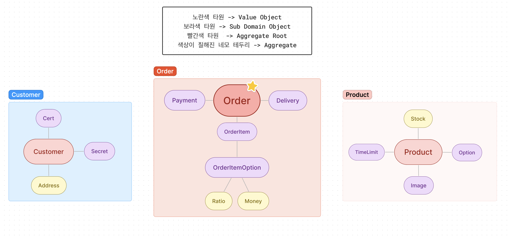
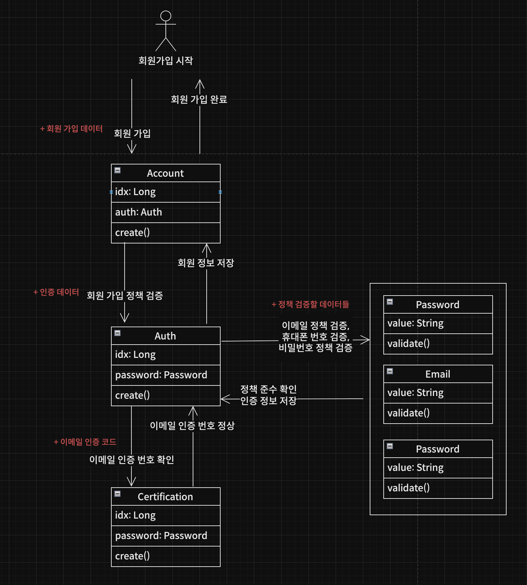
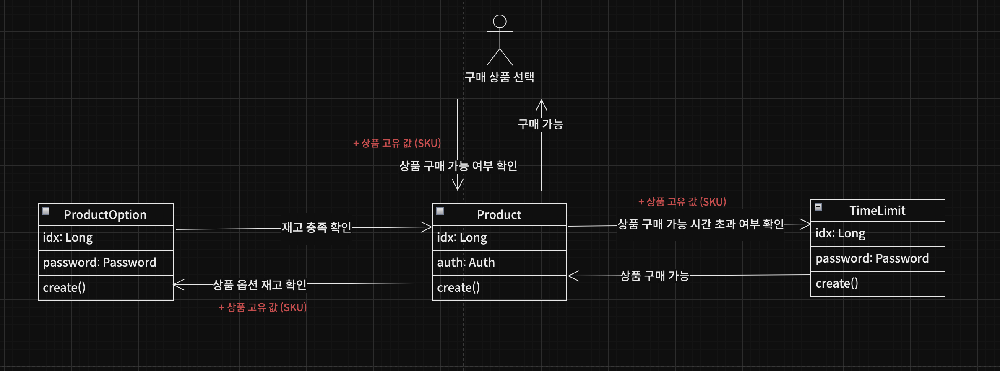
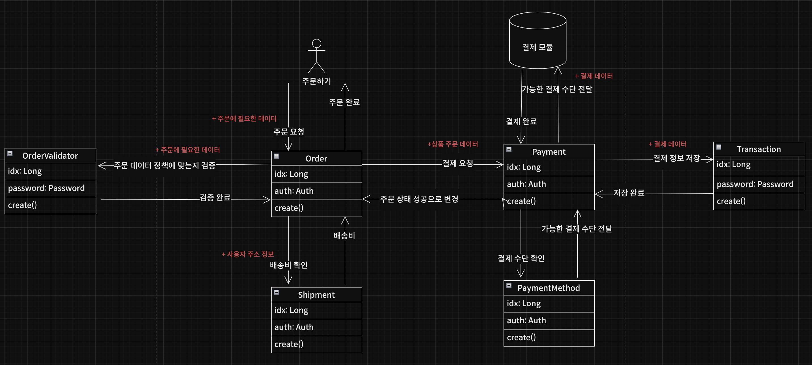

# ✧ Supreme time deal ✧

#### 슈프림의 한정판 상품을 타임딜 이벤트를 통해 구매할 수 있는 E-commerce 백엔드 서버 입니다.
#### 개발은 3월 27일 부터 하였고, 현재 진행중 입니다.

## 시나리오

### 회원

- 사용자가 회원가입을 한다.
- 사용자가 로그인을 한다.
- 사용자가 자신의 주소를 수정한다.
- 사용자가 로그아웃을 한다.

### 상품

- 사용자는 메인 화면에서 여러 정보를 가진 상품을 볼 수 있다.
    - 재고 / 구매 시간 제한 상품 / 브랜드 명/ 상품 명 / 상품 가격 (한화) / 상품 이미지 / 기타 옵션들

- 사용자는 상품 상세 페이지를 확인할 수 있다.
    - 상품에 대한 텍스트로 된 설명 / 상품 상세 이미지 / 배송비 정책

### 주문

- 사용자는 구매 정책에 맞는다면 상품을 주문할 수 있다.

    - 재고 / 시간 제한 / 로그인 / 배송지 / 핸드폰 번호 / 이름

### 결제

- 사용자는 토스페이먼츠를 통해 결제를 할 수 있다.
- 결제 완료내역은 마이 페이지에서 확인할 수 있다.

## 도메인 디자인 개요

## 사용자 디자인

## 상품 디자인

## 주문 디자인

